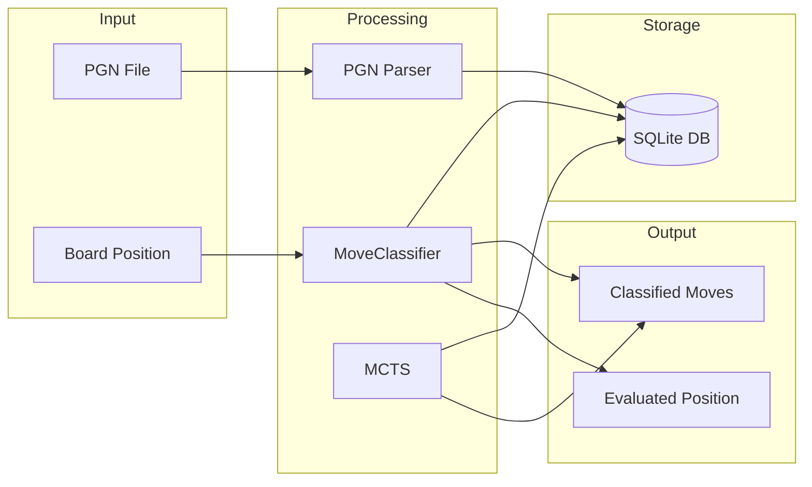

# Chess Bot - Sieciowa Analiza Ruchów Szachowych

Projekt do analizy i klasyfikacji ruchów szachowych wykorzystujący sieci neuronowe i algorytmy uczenia maszynowego. System porównuje ruchy wykonane przez sieć neuronową z idealnymi ruchami określonymi przez silnik Stockfish.

## Spis treści

- [Opis projektu](#opis-projektu)
- [Wymagania](#wymagania)
- [Instalacja](#instalacja)
- [Użycie](#użycie)
- [Struktura projektu](#struktura-projektu)
- [Architektura](#architektura)
- [Klasyfikacja ruchów](#klasyfikacja-ruchów)

## Opis projektu

Chess Bot to zaawansowany system do analizy partii szachowych, który:

- **Klasifikuje ruchy** jako: Best, Excellent, Good, Inaccuracy, Mistake, Blunder
- **Ocenia pozycje** za pomocą wartości od -1 do 1
- **Porównuje** ruchy sieci neuronowej z rekomendacjami Stockfish
- **Generuje dane treningowe** poprzez gry self-play
- **Posiada API REST** do interakcji z systemem
- **Obsługuje interfejs webowy** do analizy partii

## Wymagania

- Python 3.8+
- PyTorch >= 2.0.0
- NumPy >= 1.21.0
- chess >= 1.1.0
- FastAPI >= 0.100.0
- Uvicorn >= 0.22.0
- tqdm >= 4.65.0
- Stockfish (opcjonalnie, dla porównań)

## Instalacja

1. Zainstaluj zależności:
```bash
pip install -r requirements.txt
```

2. Pobierz Stockfish (opcjonalnie):
```bash
# Pobierz z https://github.com/official-stockfish/Stockfish/releases
# i umieść w katalogu ./stockfish-ubuntu-x86-64-avx2
```

3. Uruchom serwer:
```bash
python server.py
```

## Użycie

### API Endpoints

- `GET /` - Informacje o API
- `POST /analyze` - Analiza ruchu
- `POST /compare` - Porównanie ruchu sieci z Stockfish

### Web Interface

Otwórz `index.html` w przeglądarce, aby:
- Grać szachy na desce
- Widzieć klasyfikację swoich ruchów
- Porównywać ruchy sieci neuronowej z idealnymi ruchami

### Przykłady użycia

```python
from classifiers.move_classifier import MoveClassifier

classifier = MoveClassifier()
result, value = classifier.classify_move(board.fen(), "Nf3", evaluation=0.5)
print(f"Klasyfikacja: {result.classification}")
print(f"Wartość pozycji: {value}")
```

## Struktura projektu

```
chess_bot/
├── classifiers/              # Moduł klasyfikacji ruchów
│   ├── __init__.py
│   ├── classification_config.py    # Konfiguracja klas i progów
│   ├── move_classifier.py          # Główny klasyfikator ruchów
│   ├── self_play_dataset.py        # Dane z gier self-play
│   └── train_classifier.py         # Trening sieci neuronowej
│
├── database/                 # Moduł bazy danych
│   ├── __init__.py
│   ├── chess_db.py           # Operacje CRUD na bazie danych
│   └── schema.py             # Definicje schematu SQL
│
├── engine/                   # Moduł silnika szachowego
│   ├── __init__.py
│   ├── mcts.py               # Monte Carlo Tree Search
│   └── rl_trainer.py         # Trening z wzmocnieniem
│
├── models/                   # Sieci neuronowe
│   ├── __init__.py
│   ├── chess_nets.py         # Definicje sieci (CoreNet, MoveClassifierNet)
│   └── weights_bot.pth       # Wagi modelu bot
│   └── weights_classifier.pth # Wagi klasyfikatora
│
├── parsers/                  # Parserzy formatów
│   ├── __init__.py
│   └── pgn_parser.py         # Parser plików PGN
│
├── server.py                 # FastAPI serwer
├── main.py                   # Skrypt do przetwarzania partii
├── prepare_dataset.py        # Przygotowanie danych treningowych
├── export_pgn.py             # Eksport do formatu PGN
├── test_inference.py         # Testy inferencji
├── self_play_games.pgn       # Przykładowe gry self-play
├── index.html                # Interfejs webowy
└── requirements.txt          # Wymagania
```

## Architektura


### Diagram przepływu danych



## Klasyfikacja ruchów

System klasyfikuje ruchy na podstawie oceny pozycji przed i po wykonaniu ruchu:

| Klasa | Opis | Zakres oceny |
|-------|------|--------------|
| **Best** | Najlepszy ruch | > 0.8 |
| **Excellent** | Bardzo dobry ruch | 0.5 - 0.8 |
| **Good** | Dobry ruch | 0.2 - 0.5 |
| **Inaccuracy** | Nieprecyzyjny ruch | -0.2 - 0.2 |
| **Mistake** | Błąd | -0.5 - -0.2 |
| **Blunder** | Pomyłka | < -0.5 |

### Priorytety w MCTS

```
Best: 1.0
Excellent: 0.8
Good: 0.5
Inaccuracy: 0.2
Mistake: 0.05
Blunder: 0.001
```

## Pliki i katalogi

### Root

- **server.py** - FastAPI serwer z endpointami do analizy ruchów
- **main.py** - Główny skrypt do przetwarzania i klasyfikacji partii PGN
- **prepare_dataset.py** - Skrypt do przygotowania i optymalizacji bazy danych treningowych
- **export_pgn.py** - Eksport danych z bazy do formatu PGN
- **test_inference.py** - Testy klasyfikatora na przykładowych pozycjach
- **self_play_games.pgn** - Przykładowe gry wygenerowane przez self-play
- **index.html** - Interfejs webowy do analizy partii
- **requirements.txt** - Wymagane zależności Python
- **chess_bot.db** - Baza danych SQLite (tworzona automatycznie)

### classifiers/

- **__init__.py** - Plik inicjalizujący moduł
- **classification_config.py** - Konfiguracja nazw klas, progów i wartości
- **move_classifier.py** - Główny klasyfikator ruchów wykorzystujący sieć neuronową
- **self_play_dataset.py** - Dataset do treningu na danych z gier self-play
- **train_classifier.py** - Skrypt do trenowania klasyfikatora ruchów

### database/

- **__init__.py** - Plik inicjalizujący moduł
- **chess_db.py** - Klasa ChessDatabase obsługująca operacje CRUD
- **schema.py** - Definicje tabel SQL (games, moves) i indeksów

### engine/

- **__init__.py** - Plik inicjalizujący moduł
- **mcts.py** - Implementacja Monte Carlo Tree Search z priorytetami klasyfikacji
- **rl_trainer.py** - Trening agenta z wzmocnieniem poprzez gry self-play

### models/

- **__init__.py** - Plik inicjalizujący moduł
- **chess_nets.py** - Definicje sieci neuronowych:
  - ChessResidualBlock - Blok resydualny
  - ChessCoreNet - Główna sieć ekstrahująca cechy
  - MoveClassifierNet - Sieć klasyfikująca ruchy i oceniająca pozycje
- **weights_bot.pth** - Wagi modelu bot do gier self-play
- **weights_classifier.pth** - Wagi klasyfikatora ruchów

### parsers/

- **__init__.py** - Plik inicjalizujący moduł
- **pgn_parser.py** - Parser plików PGN z filtrowaniem gier z analizą Stockfish
