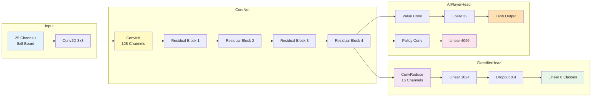
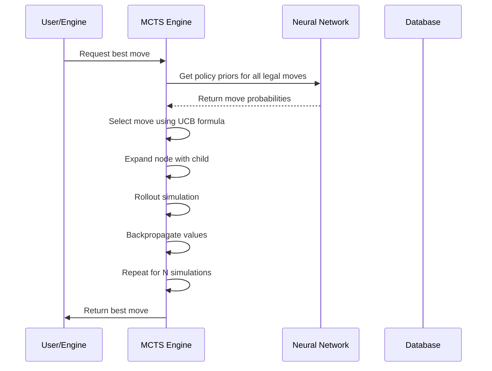

# Chess Bot - AI Move Classifier

[](https://python.org)
[](https://pytorch.org)
[](https://sqlite.org)
[](https://fastapi.tiangolo.com)

A chess AI bot that classifies moves using a neural network and Monte Carlo Tree Search (MCTS) for decision making. The bot analyzes PGN files from Lichess with Stockfish evaluations and provides move quality assessments.

## Table of Contents

- [Features](#features)
- [Project Structure](#project-structure)
- [Installation](#installation)
- [Usage](#usage)
- [API Reference](#api-reference)
- [Architecture](#architecture)
- [Move Classification](#move-classification)
- [Training](#training)
- [Contributing](#contributing)
- [License](#license)

---

## Features

- **Neural Network Move Classification**: Uses a PyTorch-based CNN to classify moves into quality categories (Best, Excellent, Good, Inaccuracy, Mistake, Blunder)
- **MCTS Engine**: Monte Carlo Tree Search for move selection with policy priors from the neural network
- **PGN Parser**: Efficient streaming parser that filters for games with Stockfish evaluations (~6% of Lichess games)
- **SQLite Database**: Persistent storage for games and move classifications
- **FastAPI Server**: REST API for real-time move suggestions
- **CLI Interface**: Command-line tool for batch processing PGN files

---

## Project Structure

```
chess_bot/
├── classifiers/
│   ├── __init__.py
│   ├── classification_config.py    # Move quality thresholds
│   ├── move_classifier.py          # Neural network classifier
│   └── train_classifier.py         # Training script
├── database/
│   ├── __init__.py
│   ├── chess_db.py                 # Database operations
│   └── schema.py                   # SQL schema definitions
├── engine/
│   ├── mcts.py                     # MCTS engine with policy integration
│   └── chess_nets.py               # Neural network architectures
├── models/
│   ├── __init__.py
│   └── weights_classifier.pth      # Trained model weights
├── parsers/
│   ├── __init__.py
│   └── pgn_parser.py               # PGN file parser
├── main.py                         # CLI entry point
├── server.py                       # FastAPI server
├── prepare_dataset.py              # Dataset preparation
├── check_db.py                     # Database checker
├── test_inference.py               # Inference testing
├── index.html                      # Web interface
└── chess_bot.db                    # SQLite database (generated)
```

---

## Installation

### Prerequisites

- Python 3.8 or higher
- pip package manager

### Setup

1. **Clone the repository** (if applicable) or navigate to the project directory:

```bash
cd /home/domanhito/Projects/SGGW/chess_bot
```

2. **Create a virtual environment** (recommended):

```bash
python -m venv venv
source venv/bin/activate  # On Windows: venv\Scripts\activate
```

3. **Install dependencies**:

```bash
pip install torch chess numpy fastapi uvicorn sqlite3
```

4. **Initialize the database**:

```bash
python main.py init
```

5. **Verify installation**:

```bash
python main.py --help
```

---

## Usage

### Command Line Interface

The bot provides a CLI with multiple commands:

```bash
# Initialize the database
python main.py init

# Parse and classify a PGN file
python main.py parse games.pgn

# Parse multiple PGN files
python main.py parse game1.pgn game2.pgn

# Get player statistics
python main.py stats Carlsen

# List all games in the database
python main.py list --limit 100

# Show classifications for a specific game
python main.py classify 1
```

### API Server

Start the FastAPI server:

```bash
python server.py
```

The server will run on `http://127.0.0.1:8000`

**Available endpoints:**

| Endpoint | Method | Description |
|----------|--------|-------------|
| `/get_move` | GET | Get the best move for a given FEN position |

**Example request:**

```bash
curl -X GET "http://127.0.0.1:8000/get_move?fen=rnbqkbnr/pppppppp/8/8/8/8/PPPPPPPP/RNBQKBNR%20w%20KQkq%20-%200%201"
```

**Example response:**

```json
{
  "move_uci": "g1f3",
  "move_san": "Nf3"
}
```

---

## API Reference

### `/get_move` - Get Best Move

Returns the best move for a given chess position.

**Parameters:**

| Parameter | Type | Description |
|-----------|------|-------------|
| `fen` | string | FEN string representing the board position |
| `simulations` | integer | Number of MCTS simulations (default: 80) |

**Response:**

```json
{
  "move_uci": "e2e4",
  "move_san": "e4"
}
```

**Error Response:**

```json
{
  "error": "Game over",
  "result": "1-0"
}
```

---

## Architecture

### System Overview

```mermaid
graph TB
    subgraph Input Layer
        A[PGN Files] --> B[PGN Parser]
    end
    
    subgraph Neural Network
        B --> C[ChessCoreNet]
        C --> D[MoveClassifierNet]
        D --> E[Classification Output]
    end
    
    subgraph MCTS Engine
        E --> F[MCTS Node]
        F --> G[Policy Priors]
        G --> H[UCB Selection]
        H --> I[Rollout Evaluation]
        I --> F
    end
    
    subgraph Database
        B --> J[SQLite Database]
        J --> K[Games Table]
        J --> L[Moves Table]
    end
    
    subgraph API
        M[FastAPI Server] --> N[/get_move Endpoint]
        N --> O[MCTS Engine]
    end
    
    style A fill:#e1f5fe
    style E fill:#fff3e0
    style H fill:#f3e5f5
    style J fill:#e8f5e9
    style M fill:#fce4ec
```

### Neural Network Architecture



### MCTS Search Process



---

## Move Classification

The neural network classifies moves into six quality categories based on evaluation thresholds:

| Category | Evaluation Range | Description |
|----------|------------------|-------------|
| **Best** | 0.0 - 0.02 | Perfect or nearly perfect move |
| **Excellent** | 0.02 - 0.15 | Very good move |
| **Good** | 0.15 - 0.40 | Normal game move |
| **Inaccuracy** | 0.40 - 0.80 | Questionable move |
| **Mistake** | 0.80 - 1.50 | Obvious error |
| **Blunder** | 1.50 - 100.0 | Blunder (piece loss/mate) |

### Classification Priority Weights

The MCTS engine uses these weights when converting classifications to policy probabilities:

| Category | Weight |
|----------|--------|
| Best | 1.0 |
| Excellent | 0.8 |
| Good | 0.5 |
| Inaccuracy | 0.2 |
| Mistake | 0.05 |
| Blunder | 0.001 |

---

## Training

### Dataset Preparation

The project includes a dataset preparation script that filters Lichess PGN files for games with Stockfish evaluations.

```bash
python prepare_dataset.py --input games.pgn --output filtered_games.pgn
```

### Training the Classifier

```bash
python classifiers/train_classifier.py --input dataset.pgn --output models/weights_classifier.pth
```

### Testing Inference

```bash
python test_inference.py --model models/weights_classifier.pth --test_cases test_cases.json
```

---

## Database Schema

### Games Table

| Column | Type | Description |
|--------|------|-------------|
| id | INTEGER | Primary key |
| white_player | TEXT | White player name |
| black_player | TEXT | Black player name |
| fen_start | TEXT | Starting FEN position |
| fen_end | TEXT | Ending FEN position |
| result | TEXT | Game result (1-0, 0-1, 1/2-1/2, *) |
| classification | TEXT | Overall game classification |
| created_at | TIMESTAMP | Creation timestamp |

### Moves Table

| Column | Type | Description |
|--------|------|-------------|
| id | INTEGER | Primary key |
| game_id | INTEGER | Foreign key to games |
| move_number | INTEGER | Move number in game |
| fen_before | TEXT | FEN before move |
| fen_after | TEXT | FEN after move |
| move_san | TEXT | Algebraic notation |
| classification | TEXT | Move quality classification |
| evaluation | REAL | Stockfish evaluation |
| created_at | TIMESTAMP | Creation timestamp |

---

## Contributing

Contributions are welcome! Please follow these guidelines:

1. Fork the repository
2. Create a feature branch
3. Make your changes
4. Run tests
5. Submit a pull request

### Code Style

- Use type hints for all functions
- Follow PEP 8 guidelines
- Add docstrings to all public functions
- Include tests for new features

---

## License

This project is licensed under the MIT License - see the LICENSE file for details.

---

## Dependencies

| Package | Version | Purpose |
|---------|---------|---------|
| torch | 2.0+ | Neural network framework |
| chess | 1.0+ | Chess game logic |
| numpy | 1.24+ | Numerical operations |
| fastapi | 0.100+ | API framework |
| uvicorn | 0.27+ | ASGI server |

---

## Troubleshooting

### Database not found

Run the initialization command:

```bash
python main.py init
```

### Model weights not found

Ensure the weights file exists:

```bash
ls -la models/weights_classifier.pth
```

### Import errors

Reinstall dependencies:

```bash
pip install -r requirements.txt
```

---

## Support

For issues and questions, please open an issue on the repository or contact the maintainers.
