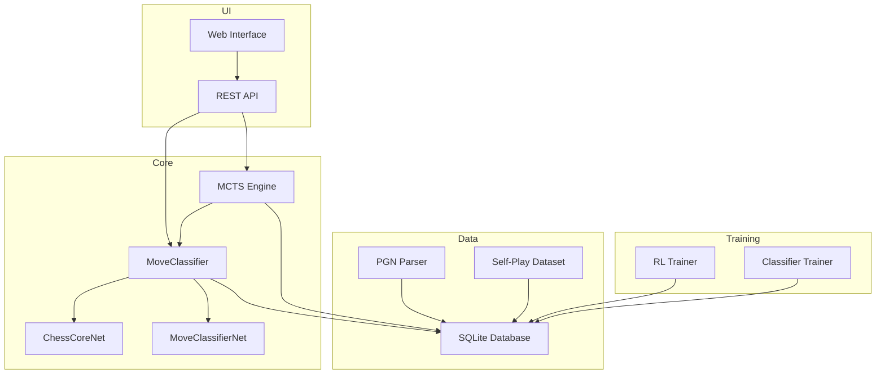
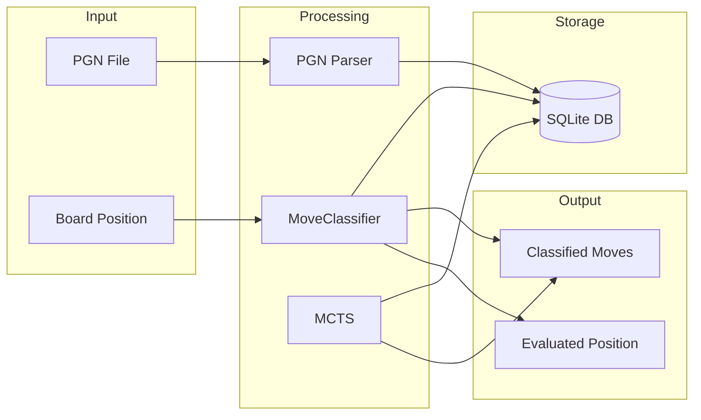

# Chess Bot - Neural Network Move Classifier

A chess analysis system that uses neural networks and machine learning algorithms to classify and evaluate chess moves. The system compares moves made by a neural network with ideal moves determined by Stockfish.

## Table of Contents

- [Project Description](#project-description)
- [Requirements](#requirements)
- [Installation](#installation)
- [Usage](#usage)
- [API Endpoints](#api-endpoints)
- [CLI Commands](#cli-commands)
- [Project Structure](#project-structure)
- [Architecture](#architecture)
- [Move Classification](#move-classification)
- [Training Loop](#training-loop)
- [Database Schema](#database-schema)

## Project Description

Chess Bot is an advanced chess analysis system that:

- **Classifies moves** as: Best, Excellent, Good, Inaccuracy, Mistake, Blunder
- **Evaluates positions** using values from -1 to 1
- **Compares** neural network moves with Stockfish recommendations
- **Generates training data** through self-play games
- **Provides REST API** for system interaction
- **Supports web interface** for game analysis

## Requirements

- Python 3.8+
- PyTorch >= 2.0.0
- NumPy >= 1.21.0
- chess >= 1.1.0
- FastAPI >= 0.100.0
- Uvicorn >= 0.22.0
- tqdm >= 4.65.0
- pandas >= 1.3.0
- matplotlib >= 3.4.0
- scikit-learn >= 0.24.0
- Stockfish binary (optional, for move analysis)

## Installation

1. Install dependencies:
```bash
pip install -r requirements.txt
```

2. Download Stockfish (optional, for move analysis):
```bash
# Download from https://stockfishchess.org/download/
# Place at ./stockfish
```

3. Start the server:
```bash
python server.py
```

## Usage

### API Endpoints

- `GET /` - API information
- `GET /analyze_move` - Analyze a move (requires FEN and SAN)
- `GET /get_move` - Get bot's best move (requires FEN, optional simulations count)

#### `/analyze_move` Parameters
- `fen` (string): Board position in FEN notation
- `move_san` (string): Move in SAN notation

#### `/get_move` Parameters
- `fen` (string): Board position in FEN notation
- `simulations` (int, default: 100): Number of MCTS simulations

#### Response Example
```json
{
  "move_uci": "e2e4",
  "move_san": "e4",
  "bot_nn_class": "Excellent",
  "bot_ideal_class": "Best"
}
```

### CLI Commands

```bash
# Initialize the database
python main.py init

# Parse and classify PGN files
python main.py parse games.pgn

# Get player statistics
python main.py stats PlayerName

# List all games
python main.py list --limit 100

# Show classifications for a specific game
python main.py classify 1

# Run continuous self-play and training loop
python main.py auto-train --iters 10 --games 20 --sims 60 --epochs 5
```

#### auto-train Options
- `--iters`: Number of global iterations per cycle (default: 10)
- `--games`: Number of games generated per iteration (default: 20)
- `--sims`: Number of MCTS simulations per move (default: 60)
- `--epochs`: Number of neural network training epochs per iteration (default: 5)
- `--keep-n`: Number of last games to keep in database (default: 100)
- `--db-path`: Path to database (default: chess_bot.db)
- `--workers`: Number of processes for parallel game generation (default: 1)

### Web Interface

Open `index.html` in a browser to:
- Play chess on the board
- See classification of your moves
- Compare neural network moves with ideal moves

### Python Usage Example

```python
from classifiers.move_classifier import MoveClassifier

classifier = MoveClassifier()
result, value = classifier.classify_move(
    board_fen="rnbqkbnr/pppppppp/8/8/8/8/PPPPPPPP/RNBQKBNR w KQkq - 0 1",
    move_san="Nf3",
    evaluation=0.5,
    turn_num=1,
    turn_label="White"
)
print(f"Classification: {result.classification}")
print(f"Position value: {value}")
```

## Project Structure

```
chess_bot/
├── classifiers/              # Move classification module
│   ├── __init__.py
│   ├── classification_config.py    # Class names and thresholds
│   ├── move_classifier.py          # Main move classifier
│   ├── self_play_dataset.py        # Self-play training dataset
│   └── train_classifier.py         # Classifier training script
│
├── database/                 # Database operations module
│   ├── __init__.py
│   ├── chess_db.py           # CRUD operations for games and moves
│   └── schema.py             # SQL schema definitions
│
├── engine/                   # Chess engine module
│   ├── __init__.py
│   ├── mcts.py               # Monte Carlo Tree Search with classification priorities
│   └── rl_trainer.py         # Reinforcement learning training loop
│
├── models/                   # Neural network models
│   ├── __init__.py
│   ├── chess_nets.py         # Network definitions (ChessCoreNet, MoveClassifierNet)
│   ├── weights_bot.pth       # Bot weights for self-play
│   └── weights_classifier.pth # Classifier weights
│
├── parsers/                  # Format parsers
│   ├── __init__.py
│   └── pgn_parser.py         # PGN file parser with Stockfish filter
│
├── server.py                 # FastAPI server
├── main.py                   # CLI for PGN processing
├── prepare_dataset.py        # Database optimization script
├── export_pgn.py             # Export self-play games to PGN
├── test_inference.py         # Inference tests
├── self_play_games.pgn       # Example self-play games
├── index.html                # Web interface
└── requirements.txt          # Python dependencies
```

## Architecture



### Data Flow Diagram



## Move Classification

The system classifies moves based on the evaluation delta (change in position value) before and after the move:

| Class | Description | Delta Range |
|-------|-------------|-------------|
| **Best** | Best move | 0.0 - 0.02 |
| **Excellent** | Very good move | 0.02 - 0.15 |
| **Good** | Good move | 0.15 - 0.40 |
| **Inaccuracy** | Inaccurate move | 0.40 - 0.80 |
| **Mistake** | Mistake | 0.80 - 1.50 |
| **Blunder** | Blunder | > 1.50 |

### MCTS Move Priorities

```
Best: 1.0
Excellent: 0.8
Good: 0.5
Inaccuracy: 0.2
Mistake: 0.05
Blunder: 0.001
```

## Training Loop

The training loop consists of three phases:

### Phase 1: Self-Play Game Generation
Generates games using the MCTS engine with temperature-based exploration. Games are saved to the `self_play_moves` table.

### Phase 2: Bot Neural Network Training
Trains the bot network using:
- Cross-entropy loss for classification
- MSE loss for value prediction
- AdamW optimizer with learning rate scheduling
- Sliding window to keep only the most recent games

### Phase 3: Sliding Window
Maintains a fixed-size dataset by keeping only the last N games, ensuring the model trains on recent data.

### Running Training

```bash
python main.py auto-train --iters 10 --games 20 --sims 60 --epochs 5 --keep-n 100
```

## Database Schema

### games Table
```sql
CREATE TABLE games (
    id INTEGER PRIMARY KEY AUTOINCREMENT,
    white_player TEXT NOT NULL,
    black_player TEXT NOT NULL,
    fen_start TEXT,
    fen_end TEXT,
    result TEXT,
    classification TEXT,
    created_at TIMESTAMP DEFAULT CURRENT_TIMESTAMP,
    updated_at TIMESTAMP DEFAULT CURRENT_TIMESTAMP
)
```

### moves Table
```sql
CREATE TABLE moves (
    id INTEGER PRIMARY KEY AUTOINCREMENT,
    game_id INTEGER NOT NULL,
    move_number INTEGER NOT NULL,
    fen_before TEXT,
    fen_after TEXT,
    move_san TEXT,
    classification TEXT,
    evaluation REAL,
    created_at TIMESTAMP DEFAULT CURRENT_TIMESTAMP,
    FOREIGN KEY (game_id) REFERENCES games (id) ON DELETE CASCADE
)
```

### self_play_moves Table
```sql
CREATE TABLE self_play_moves (
    id INTEGER PRIMARY KEY AUTOINCREMENT,
    game_id INTEGER,
    fen_before TEXT,
    move_uci TEXT,
    mcts_policy TEXT,
    result_value REAL
)
```

## Neural Network Architecture

### ChessCoreNet
- Input: 25-channel board representation (12 piece types + turn indicator)
- Initial convolution: 3x3 kernel, 128 output channels
- 4 residual blocks with BatchNorm and ReLU
- Output: 128-channel feature map

### MoveClassifierNet
- Input: 128-channel feature map from ChessCoreNet
- Convolution reduction: 1x3 kernel to 16 channels
- Fully connected layer: 16*8*8 -> 256
- Dropout: 0.4
- Classification head: 256 -> 6 (class logits)
- Value head: 16*8*8 -> 32 -> 1 (tanh-scaled value)

## License

This project is open source.
